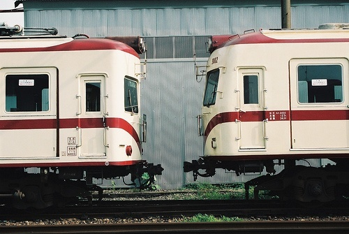
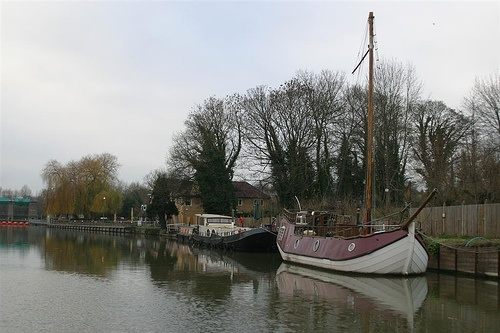
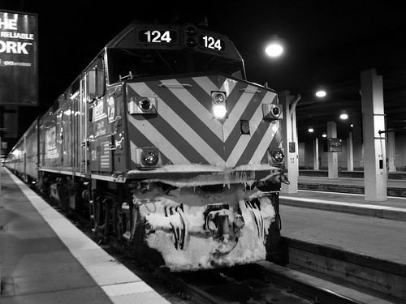

# DeepLab v3

Lei Mao, Shengjie Lin

University of Chicago

Toyota Technological Institute at Chicago

## Introduction


DeepLab is the state-of-art image semantic segmentation model developed by Google. Its latest version is v3+ which employes an encoder-decoder architecture with atrous spatial pyramid prooling (ASPP). While the model works extremely well for semantic segmentation, its open sourced code is extremely hard to read (at least from my personal perspective). Here we reimplemented the DeepLab v3, the earlier version of DeepLab v3+ which employs encoder architecture with ASPP, in a much simpler and understandable way.


## Dependencies

* Python 3.5
* TensorFlow 1.8
* Tqdm 4.26.0
* Numpy 1.14
* OpenCV 3.4.3
* Pillow 5.3.0

## Files

```
.
├── archieved
├── download.py
├── feature_extractor.py
├── LICENSE.md
├── model.py
├── modules.py
├── nets
├── README.md
├── test_demo.py
├── train.py
└── utils.py
```

The `nets` directory containing network training files was copied from [`tensorflow/models/research/slim/nets`](https://github.com/tensorflow/models/tree/1af55e018eebce03fb61bba9959a04672536107d/research/slim/nets)

## Usages

### Download Dataset

Download and unzip VOC2012 dataset, SBD dataset, and pretrained models to designated directories.

```bash
$ python download.py --help
usage: download.py [-h] [--downloads_dir DOWNLOADS_DIR] [--data_dir DATA_DIR]
                   [--pretrained_models_dir PRETRAINED_MODELS_DIR]
                   [--pretrained_models PRETRAINED_MODELS [PRETRAINED_MODELS ...]]

Download DeepLab semantic segmentation datasets and pretrained backbone
models.

optional arguments:
  -h, --help            show this help message and exit
  --downloads_dir DOWNLOADS_DIR
                        Downloads directory
  --data_dir DATA_DIR   Data directory
  --pretrained_models_dir PRETRAINED_MODELS_DIR
                        Pretrained models directory
  --pretrained_models PRETRAINED_MODELS [PRETRAINED_MODELS ...]
                        Pretrained models to download: resnet_50, resnet_101,
                        mobilenet_1.0_224
```

For example, to download and extract datasets and models into directories specified:

```bash
$ python download.py --downloads_dir ./downloads --data_dir ./data --pretrained_models_dir ./models/pretrained --pretrained_models resnet_50 resnet_101 mobilenet_1.0_224
```

For simplicity, please just run the following command in terminal:

```bash
$ python download.py
```


### Train Model

```bash
$ python train.py --help
usage: train.py [-h] [--network_backbone NETWORK_BACKBONE]
                [--pre_trained_model PRE_TRAINED_MODEL]
                [--trainset_filename TRAINSET_FILENAME]
                [--valset_filename VALSET_FILENAME] [--images_dir IMAGES_DIR]
                [--labels_dir LABELS_DIR]
                [--trainset_augmented_filename TRAINSET_AUGMENTED_FILENAME]
                [--images_augmented_dir IMAGES_AUGMENTED_DIR]
                [--labels_augmented_dir LABELS_AUGMENTED_DIR]
                [--model_dir MODEL_DIR] [--log_dir LOG_DIR]
                [--random_seed RANDOM_SEED]

Train DeepLab v3 for image semantic segmantation.

optional arguments:
  -h, --help            show this help message and exit
  --network_backbone NETWORK_BACKBONE
                        Network backbones: resnet_50, resnet_101,
                        mobilenet_1.0_224. Default: resnet_101
  --pre_trained_model PRE_TRAINED_MODEL
                        Pretrained model directory
  --trainset_filename TRAINSET_FILENAME
                        Train dataset filename
  --valset_filename VALSET_FILENAME
                        Validation dataset filename
  --images_dir IMAGES_DIR
                        Images directory
  --labels_dir LABELS_DIR
                        Labels directory
  --trainset_augmented_filename TRAINSET_AUGMENTED_FILENAME
                        Train augmented dataset filename
  --images_augmented_dir IMAGES_AUGMENTED_DIR
                        Images augmented directory
  --labels_augmented_dir LABELS_AUGMENTED_DIR
                        Labels augmented directory
  --model_dir MODEL_DIR
                        Trained model saving directory
  --log_dir LOG_DIR     TensorBoard log directory
  --random_seed RANDOM_SEED
                        Random seed for model training.
```

For simplicity, please just run the following command in terminal:

```bash
$ python train.py
```

With learning rate of ``1e-5``, the mIOU could be greater 0.7 after 20 epochs, which is comparable to the test statistics of DeepLab v3 in the publication.

### Test Model

Image| Label | Prediction |
:-------------------------:|:-------------------------:|:-------------------------:
  |   |  

Image| Label | Prediction |
:-------------------------:|:-------------------------:|:-------------------------:
  |   |  

Image| Label | Prediction |
:-------------------------:|:-------------------------:|:-------------------------:
  |   |  

Image| Label | Prediction |
:-------------------------:|:-------------------------:|:-------------------------:
  |   |  


## References

L.-C. Chen, G. Papandreou, I. Kokkinos, K. Murphy, and A. L. Yuille. [Deeplab: Semantic Image Segmentation with Deep Convolutional Nets, Atrous Convolution, and Fully Connected CRFs](https://arxiv.org/abs/1606.00915). TPAMI, 2017.

L.-C. Chen, G. Papandreou, F. Schroff, and H. Adam. [Rethinking Atrous Convolution for Semantic Image Segmentation](https://arxiv.org/abs/1706.05587). arXiv:1706.05587, 2017.

L.-C. Chen, Y. Zhu, G. Papandreou, F. Schroff, H. Adam. [Encoder-Decoder with Atrous Separable Convolution for Semantic Image Segmentation](https://arxiv.org/abs/1802.02611). arXiv:1802.02611, 2018.


